# Manhua Matchmaker
### [Live Demo: manhua-matchmaker.streamlit.app](https://manhua-matchmaker.streamlit.app/)

[](https://www.python.org/)
[](https://streamlit.io/)
[](https://www.sbert.net/)
[](https://github.com/facebookresearch/faiss)

---
## Overview

**Manhua Matchmaker Pro** is a content-based recommendation system that enables semantic discovery of manga, manhua, and manhwa based on **narrative intent and thematic similarity**, rather than popularity or coarse genre tags.

The system is designed to reflect real-world constraints: fragmented data sources, inconsistent naming conventions, noisy metadata, and the need for low-latency search at scale.

---


## 🔴 The Problem 
Discovery in the world of Manhua (Chinese) and Manhwa (Korean) is plagued by **low-quality metadata** and **fragmented data sources**. 

- **Standard search** relies on exact keyword matching, failing users looking for a specific "vibe" (e.g., *"Genre-subverting isekai with a weak-to-strong MC"*).
- **Inconsistent Naming**: Titles vary wildly across platforms (e.g., *"Solo Leveling"* vs *"Only I Level Up"*), creating a massive deduplication challenge.
- **Aggregator Friction**: Existing readers are cluttered with intrusive ads and broken image links due to shifting domain-level hotlinking protections.

**Manhua Matchmaker Pro** solves this by providing a unified, high-performance semantic search engine and a custom, ad-free reverse-proxy reader.

This project addresses these gaps through **semantic search, entity resolution, and a clean application layer**.


---

## 🏗️ System Architecture

The system follows a left-to-right data flow:

**External APIs → Data Engineering → NLP Modeling → Vector Search → Application UI**

```mermaid
flowchart LR
    subgraph "Data Sources"
        A["MangaDex API"]
        B["AniList API"]
    end

    subgraph "Data Engineering"
        C["ETL Pipeline<br/>(Cleaning + Deduplication)"]
        D["Golden Record Store"]
    end

    subgraph "NLP & Search"
        E["Text Embeddings<br/>(TF-IDF → MiniLM)"]
        F["Vector Index<br/>(FAISS)"]
    end

    subgraph "Application Layer"
        G["Streamlit App<br/>(Search + Analytics)"]
    end

    A --> C
    B --> C
    C --> D
    D --> E
    E --> F
    F --> G
    G -. "Optional Reader Mode" .-> A
```



---

## 🛠️ Tech Stack
- **APIs**: MangaDex (REST), AniList (GraphQL).
- **Models**: `SentenceTransformers` (`all-MiniLM-L6-v2`), `TfidfVectorizer`.
- **Backend**: Python 3.11, `FAISS` (Facebook AI Similarity Search).
- **Entity Resolution**: `RapidFuzz` (C++ backend).
- **Deployment**: GitHub Actions (CI/CD), Streamlit.

---

## 🚜 Data Engineering Deep Dive
Building a reliable dataset from unstable APIs required robust engineering:

- **Ingestion**: Efficiently fetched and merged ~10,000 titles, prioritizing original language (CN/KR/HK) and high follower counts.
- **Entity Resolution**: 
  - Performed fuzzy matching using **Levenshtein distance** to resolve duplicates between MangaDex and AniList.
  - **Optimization**: Switched from $O(N^2)$ brute-force matching to a **Character-Level Blocking** strategy (first-letter partitioning). This reduced the search space by 98%, leading to a **600x speedup** (from 10 mins to <1.5 seconds).
- **Golden Record Creation**: 
  - **Rich Metadata**: Concatenated titles, alt-titles, tags, and descriptions into a `combined_text` field for maximum semantic signal.
  - **Atomic Persistence**: Implemented atomic writes (Temp-file + Rename) to prevent data corruption during network interruptions.

---

## 🧠 Modeling Strategy: Hybrid Reranking
To achieve "FAANG-level" search relevance, I didn't just use embeddings; I built a hybrid retriever:

1. **Step 1: Dense Retrieval (The "Vibe")**: Uses `FAISS` and `SentenceTransformers` to find the top 200 candidates based on plot/thematic similarity.
2. **Step 2: Sparse Reranking (The Keywords)**: Scores candidates using `TF-IDF` to ensure specific keywords in the query are respected.
3. **Step 3: Title Boosting**: A custom heuristic identifies if a query matches a primary or alternative title exactly, applying a massive weight boost to ensure specific series always appear as #1.
   - *Example*: Searching "Solo Leveling" returns the main series with a perfect 1.0 score, rather than the "Book Version" or spin-offs.

---

## ✨ Features (The User Value)
- **Zero-Ad Reader**: High-performance reverse proxy that fetches raw image streams and serves them as **Base64 strings**, bypassing hotlinking protections for a smooth "Webtoon-style" experience.
- **Semantic Explanations**: Every result includes a **"Why this match?"** breakdown, showing scores for Vibe Similarity, Keyword Match, and Title Boosts.
- **Discovery Mode**: A refined search limit slider (10-100 results) for both precision-seekers and deep-divers.

---

## � Scale, Performance, and Constraints
- **Latency**: Semantic reranking of 10,000+ titles completes in **<100ms** on standard CPU hardware.
- **Dataset Scale**: Currently indexing ~5,000 highly curated Manhua/Manhwa titles.
- **Automatic Retraining**: Automated GitHub Action triggers every Monday at Midnight to refresh the vector index and ingest new chapters.

---

## � What I’d Improve With More Time
- **Cross-Lingual Embeddings**: Utilizing `multilingual-e5` to allow users to search in their native language and find Chinese/Korean-native works.
- **Infrastructure**: Transitioning from a flat JSON store to a dedicated NoSQL Vector Database (like Pinecone or ChromaDB) for horizontal scalability.
- **Quantization**: Implementing FP16 quantization for embeddings to reduce memory footprint by 50% for larger datasets.

---

## ⚙️ How to Run
```bash
# 1. Install dependencies
uv sync

# 2. Run the application
uv run streamlit run src/app/main.py
```

---

## 🏁 Closing Statement
This project isn't just a search engine; it's a demonstration of how **Data Engineering** (ETL/Deduplication) and **ML System Design** (Hybrid Search) can solve real-world content discovery friction.

---
**Author**: [Vinay Devabhaktuni](https://github.com/vinu-ds) | [LinkedIn](https://linkedin.com/in/vinay-devabhaktuni)
